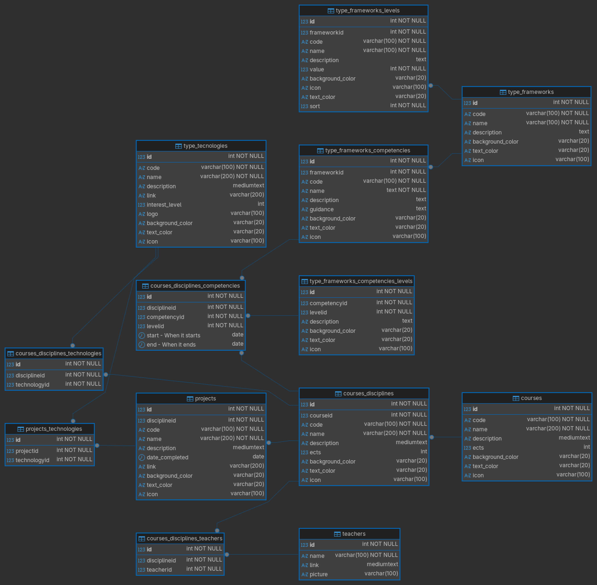

## Intro
This is a WIP project and the history will be on the commits
I do not use AI, simple as that.

## Why?

#### DB
Since I have some experience in Databases, the probelm to me, is where to stop. Decided the 3NF is the sweet spot.
Also, this models have already fields to be used on the web, like colors and icons. 

#### Table names so long?
We do not pay by the character and this why is simpler for everyone reading the DB and also helps alot the Data people when they get a DUMP. The only problem are FKs, but one can alwayys edit them.

#### Type Tables?
Yes, I like to separete what is an actual table with data and the ones that are Types. Like Types of Status, Types of Levels, Types of Frameworks and so on. Normally those are my "source data" for other tables.

#### The ER Diagram

One can start with a paper, indeed

Experience tells me one is better doing it on a DB and tweak it along the way, and that will be documented on screenshot (below) from my DB created for this purpose.

#### Code Field
The CODE field is something I find very usefull, when coding I do NOT want IDs moving around, CODEs will be used. If the BD needs to be regreated for some reason and all the IDs change, the code will continue to work fine.

## Structure

The main entities (so far) are:

### Courses
#### Will store the courses that exist
  - ID
  - Code - A unique code within the couses, because I do not want to be doing code with IDs
  - Name
  - Description
  - ECTS
  - Background Color - This is to be able to create some visual help on the website
  - Text Color - This is to be able to create some visual help on the website
  - Icon - Using Fontawesome icons to look nicer

### Why so complicated Frameworks structure?
#### This is what companies are using to develop roles that people are in. This way they can map a competency vs a role and then check if the person has it and what course must be taken to achieve that competency.

### Type_Frameworks
#### It will store all frameworks that could be used
  - ID
  - Code - A unique code within the Frameworks, because I do not want to be doing code with IDs
  - Name
  - Description
  - Background Color - This is to be able to create some visual help on the website
  - Text Color - This is to be able to create some visual help on the website
  - Icon - Using Fontawesome icons to look nicer

### Type_Frameworks_Levels
#### What levels exist in a framework
  - ID
  - Frameworkid
  - Code - A unique code, because I do not want to be doing code with IDs
  - Name
  - Description
  - Value
  - Background Color - This is to be able to create some visual help on the website
  - Text Color - This is to be able to create some visual help on the website
  - Icon - Using Fontawesome icons to look nicer
  - Sort

### Type_Frameworks_Competencies
#### What competencies does a certain framework provide. It will contain all of them
  - ID
  - Frameworkid
  - Code - A unique code, because I do not want to be doing code with IDs
  - Name
  - Description
  - Guidance
  - Background Color - This is to be able to create some visual help on the website
  - Text Color - This is to be able to create some visual help on the website
  - Icon - Using Fontawesome icons to look nicer

### Type_Frameworks_Competencies
#### What competencies does a certain framework provide. It will contain all of them
  - ID
  - Frameworkid
  - Code - A unique code, because I do not want to be doing code with IDs
  - Name
  - Description
  - Guidance
  - Background Color - This is to be able to create some visual help on the website
  - Text Color - This is to be able to create some visual help on the website
  - Icon - Using Fontawesome icons to look nicer

### Disciplines_Competencies
#### Will store what competencies the disciplines provides 
  - ID
  - DisciplineID
  - CompetencyID
  - LevelID
  - Start - When it started to be valid
  - End - When it ended

### Projects
#### This table will contain the projects done thru the course, it will be linked with disciplines

  - ID
  - Code - A unique code, because I do not want to be doing code with IDs
  - Name
  - Description
  - Logo - Logo image
  - Link - Link to the project page, if it exists
  - Background Color - This is to be able to create some visual help on the website
  - Text Color - This is to be able to create some visual help on the website
  - Icon - Using Fontawesome icons to look nicer

### Disciplines
#### This table will contain the disciplines

  - ID
  - Code - A unique code within the disciplines, because I do not want to be doing code with IDs
  - Name
  - Description
  - Background Color - This is to be able to create some visual help on the website
  - Text Color - This is to be able to create some visual help on the website
  - Icon - Using Fontawesome icons to look nicer

### Tecnologies
#### This table will contain the tecnologies and they will be linked with disciplnes and projects

  - ID
  - Code - A unique code, because I do not want to be doing code with IDs
  - Name
  - Description
  - Interest level - from 1 to 5
  - Logo - Logo image
  - Link - Link to the project page, if it exists
  - Background Color - This is to be able to create some visual help on the website
  - Text Color - This is to be able to create some visual help on the website
  - Icon - Using Fontawesome icons to look nicer

### Teachers
#### This table will contain all the teachers

  - ID
  - Name
  - Photo
  - Link - Link to the profile page

### Certifications
#### This table will contain all the certifications done

  - ID
  - Code - A unique code, because I do not want to be doing code with IDs
  - Name
  - Description
  - Start Data
  - End Date
  - Link - Link to the project page, if it exists
  - Background Color - This is to be able to create some visual help on the website
  - Text Color - This is to be able to create some visual help on the website
  - Icon - Using Fontawesome icons to look nicer

### Final Projects (TFCs)
#### This table will contain all the final projects done by students of a course. This needs to be refectored later if we wanna use the the 3NF in the DB

  - ID
  - Course - Reference to the course this project was done for
  - Title - 
  - Summary - 
  - Year - 
  - Students - 
  - Email - 
  - Supervisor - The name of the project supervisor
  - Report Link - Link to the project report, if it exists
  - Keywords - Semicolon-separated keywords that describe the project
  - Areas - Semicolon-separated areas of knowledge covered by the project
  - Image - Link to the project image, if it exists
  - Rating - A numeric rating for the project
  - Background Color - This is to be able to create some visual help on the website
  - Text Color - This is to be able to create some visual help on the website
  - Icon - Using Fontawesome icons to look nicer